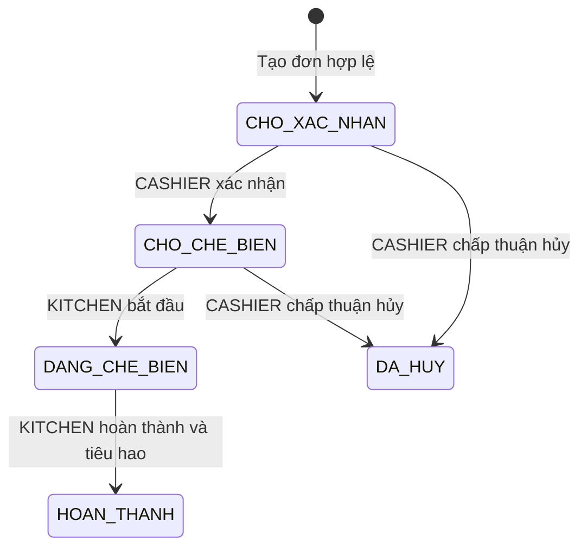
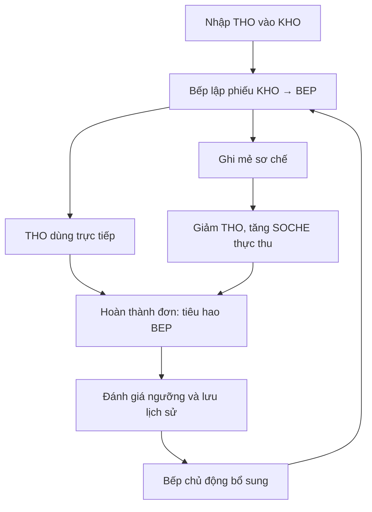

# MilkTea — vận hành từ tổng thể tới chi tiết

Dùng [domain_system.md](domain_system.md) làm nguồn quy tắc. File này mô tả cách các thành phần thực hiện quy tắc; không tạo trạng thái hay vai trò mới. API cụ thể ở OpenAPI, bảng ở Database, bảo mật ở Author.

## Danh mục

1. Tổng thể và ranh giới module
2. Khởi tạo quán và dữ liệu nền
3. QR, giỏ, mở phiên và gọi thêm
4. Tại quầy và gắn bàn
5. Xác nhận, chế biến, thu và đóng phiên
6. Hủy/thay thế/hoàn và sự cố
7. Kho hai tầng và cảnh báo
8. Tài khoản, tích hợp và báo cáo
9. Ma trận giao dịch và phục hồi

## 1. Tổng thể và ranh giới module

Chạy một quán, một Spring Boot MVC app và một DB được chọn. Thymeleaf render trang, Bootstrap bố cục, JS gửi HTTP và nghe STOMP. Controller nhận DTO; Service xác minh actor/phạm vi, trạng thái và thực hiện transaction; Repository đọc/khóa/ghi; SQL giữ dữ liệu đúng. Cloudinary chứa ảnh; WebSocket báo thay đổi đã commit.

| Module | Dữ liệu/việc sở hữu | Phối hợp |
|---|---|---|
| account/auth/security | Tài khoản, JWT, reset, phạm vi truy cập | Xác định người thao tác; không mở/đóng phiên bàn |
| catalog/recipe/settings | Danh mục, món theo size, giá/ảnh, định mức, giảm chung/thông tin quán | Order chốt snapshot; Inventory dùng định mức đã chốt |
| table | QR, DiningTable, TableSession, SessionCart | Order tạo/gắn cùng transaction; CASHIER đóng thủ công |
| order | Order/Item, snapshot, Invoice, trạng thái toàn đơn | CASHIER confirm; KITCHEN start/complete; Inventory ghi tiêu hao |
| payment/cancellation | Notice, thực thu, yêu cầu hủy, refund | Tiền độc lập pha; giữ thu gốc khi hủy; close kiểm dư nợ |
| inventory | THO/SOCHE, KHO/BEP, nhập/xuất/mẻ/tiêu hao/hao hụt | Complete atomic; cảnh báo để bếp bổ sung; không reservation |
| reporting | Giá trị hoàn thành, thực thu/hoàn/ròng/dư nợ | Query/projection từ chứng từ, không ghi tiền theo OrderStatus |
| notification/audit | Sau commit, phạm vi event và nhật ký | Client fetch bản chốt; socket lỗi không xóa giao dịch |

Giỏ chứa món chưa gửi; OrderItem chứa món đã gửi. TableSession là một lượt sử dụng bàn; JWT/HttpSession/socket là các cơ chế kỹ thuật khác. Xóa view/giỏ tạm không phải xóa ledger.

## 2. Khởi tạo quán và dữ liệu nền

1. ADMIN có tài khoản cấp nội bộ; đăng nhập theo UC01. Khách đăng ký chỉ được CUSTOMER.
2. Thiết lập một GlobalSettings: tên/địa chỉ/thông tin nhận chuyển khoản, tỷ lệ giảm chung.
3. Tạo Category, Product theo mã món/size/giá; upload ảnh thật qua ProductImageService và Cloudinary. Tạo bàn hoạt động và QR định danh; QR không chứa quyền nhân viên.
4. Tạo Material THO/SOCHE và đơn vị chuẩn; Stock theo materialId+location. Cấu hình ngưỡng riêng KHO/BEP. Tạo ProductRecipe và PreparationRecipe.
5. ADMIN ghi nhập THO vào KHO; KITCHEN xuất sang BEP và ghi mẻ SOCHE. Không để đơn demo complete dựa tồn giả mặc định.
6. Ngừng hoạt động dữ liệu có lịch sử thay vì xóa cứng. Thay đổi giá/công thức/giảm chỉ áp dụng snapshot mới.

## 3. QR, giỏ, mở phiên và gọi thêm

### 3.1 Truy cập

- QR hợp lệ luôn mở homepage có nhãn Bàn NN, cả Trống lẫn Có khách. Sai mã định danh thì báo lỗi; không dùng occupied làm lỗi truy cập.
- TableContextService chỉ đọc. Nếu có phiên OPEN, bootstrap quyền kỹ thuật đúng phiên theo Author; không tạo phiên hoặc đổi bàn.
- Nếu chưa phiên, xem sản phẩm/chọn size/thêm giỏ giữ RAM trang. Reload trước mở có thể mất giỏ; bàn vẫn Trống.
- Nếu có phiên, tải SessionCart/version, tất cả đơn TABLE và COUNTER đã gắn, hóa đơn, trạng thái thu/hoàn/dư nợ. Chỉ dữ liệu phục vụ bàn, không email/hồ sơ riêng.

### 3.2 Đơn đầu tiên

1. Mai gửi tableId, expectedSessionId=null, items, remainingCartItems cho giỏ chưa gửi, CSRF và Idempotency-Key; quyền bằng QR hợp lệ. Không gửi giá/giảm/account role tự quyết.
2. OrderService khóa DiningTable, kiểm expectedSessionId. Nếu người khác vừa mở phiên, trả 409 để đồng bộ; không tự mang giỏ cũ vào lượt khác.
3. Kiểm Product/size/quantity/công thức, tính tiền BigDecimal, giảm chung và chốt tên/giá/size/định mức toàn đơn.
4. Mở đúng một TableSession OPEN, đổi Có khách; tạo Order CHO_XAC_NHAN, Invoice HIEU_LUC chưa thu, OrderItems, OrderIngredientSnapshot; lưu giỏ còn lại/version trong **cùng transaction**.
5. Lỗi bước nào rollback toàn thao tác. Thành công trả order, ngữ cảnh phiên/giỏ/version, credential phù hợp; phát sau commit cho thu ngân và phiên.

### 3.3 Gọi thêm và nhiều tab

Khi có phiên: sửa giỏ bằng PUT có If-Match; đặt từ lượng đang có trong đúng cartVersion; chỉ giảm lượng đã gửi, giữ món còn lại. Request version cũ trả 409 và giỏ mới; không silent overwrite. CART_CHANGED chỉ yêu cầu fetch lại.

Reload/tab mới/quét lại QR lấy cùng phiên đang mở và giỏ/đơn/tiền chuẩn. Mỗi tab có credential scoped nhưng cùng giỏ. Nếu phiên đã đóng, làm rỗng view/token và không tự phục hồi món của lượt cũ.

## 4. Tại quầy và gắn bàn

1. CASHIER tạo đơn hoặc khách có/không tài khoản gửi giỏ quầy; server tạo COUNTER+CHO_XAC_NHAN+Invoice/snapshot. Không bắt buộc chọn bàn hay thu trước.
2. Guest chưa bàn giữ orderId/CounterOrderToken trong RAM trang. Reload mất quyền phía guest; CASHIER vẫn thấy đơn trên server, không tự hủy đơn.
3. CASHIER xác nhận đơn vào hàng đợi bếp và có thể ghi thu ở bất kỳ thời điểm hợp lệ.
4. CASHIER chủ động gắn cùng Order vào bàn. Khóa bàn/đơn, dùng phiên hiện có hoặc mở theo quyền CASHIER; giữ source COUNTER, mã đơn/hóa đơn/khoản thu và trạng thái. Không nhân đôi.
5. QR bàn lúc này đọc được đơn quầy đã gắn. QR không suy đoán đơn chưa gắn theo tên/IP/ID. Đơn thuộc phiên khác không chuyển bàn bằng chức năng này.
6. Giỏ quầy nháp chỉ chuyển chủ động khi trang còn RAM; mất RAM không khôi phục. CUSTOMER có lịch sử theo accountId server ghi lúc tạo; đăng nhập không nhận đơn chung bàn làm lịch sử cá nhân.

## 5. Xác nhận, chế biến, thu và đóng phiên

Trạng thái tiền không nằm trong sơ đồ trên. Không PATCH trạng thái tùy ý, không trạng thái từng món. Có yêu cầu hủy chờ thì chưa start. Chỉ bếp có nút complete và backend bắt buộc kiểm KITCHEN.

### 5.1 Thu linh hoạt

TABLE/COUNTER đều CASH/BANK_TRANSFER; trước/trong/sau pha. Khách gửi PaymentNotice chỉ là đề nghị/đã báo chuyển, CASHIER kiểm tiền thực rồi tạo một Payment toàn phần trên Invoice. Không chia nhiều người/lần. Invoice 0 được ghi xác nhận nội bộ theo Domain. Ghi thu không gọi confirm/start/complete/close.

### 5.2 Complete

OrderService.complete kiểm quyền/trạng thái, dùng định mức đã chốt và gọi InventoryService.completeOrderConsumption với REQUIRED. Stock BEP và stock ledger cùng commit với HOAN_THANH. Chưa thu vẫn complete được. Thiếu tồn → rollback cả đơn/kho, bếp ghi cấp/mẻ bổ sung rồi retry. Complete gửi lặp không trừ thêm.

### 5.3 Close thủ công

CASHIER chọn Kết thúc phiên/Trống. Dưới khóa bàn/phiên, kiểm mọi đơn HOAN_THANH/DA_HUY và Invoice HIEU_LUC đã thu đủ. Bàn mở thủ công chưa đơn có thể close dư nợ 0 sau xác nhận xóa giỏ.

Cùng transaction: CLOSED + closedAt/closedBy + TRONG + activeSessionId=null + xóa cart/items + thu hồi quyền phiên + audit. Giữ Order/Invoice/Payment/Refund/StockMovement/TableSession metadata. Refund đang chờ tiếp tục xử lý riêng. Sau commit, phát CLOSED cho subscriber cũ trước khi teardown; UI cũ clear. Tab cũ gửi lệnh sessionId cũ bị từ chối dù bàn có lượt mới. Thanh toán/complete/logout/tab close/socket timeout không tự close.

## 6. Hủy/thay thế/hoàn và sự cố

### 6.1 Trước pha

1. Khách đúng owner/session/counter yêu cầu hủy toàn đơn với lý do. Khóa Order và ghi request chờ; không tự DA_HUY, không đụng kho.
2. CASHIER quyết định dưới cùng quy tắc khóa. Chấp thuận chỉ trước DANG_CHE_BIEN; Invoice/Order DA_HUY, audit và RefundRequest nếu đã thu số tiền dương. Từ chối có lý do, đơn tiếp tục.
3. Tạo đơn mới liên kết replacementOfOrderId nếu muốn bỏ/đổi món; snapshot/Invoice/Payment mới, không chuyển khoản thu cũ.
4. ADMIN duyệt refund, CASHIER thực trả; chỉ refundedAt/DA_HOAN mới tính hoàn. Đóng bàn không đánh dấu đã hoàn. Hủy đồng thời start/thu phải recheck dưới khóa, không thu mới vào Invoice đã hủy.

### 6.2 Đã pha nhưng hỏng

Bếp báo Incident lý do và đơn/lượng liên quan. Server đối chiếu ledger, không tin cờ client để bỏ kiểm. Nếu lượng hỏng chưa ghi tiêu hao, ghi HAO_HUT một lần rồi hoàn thành lần đạt; nếu lượng đã debit, chỉ audit liên kết. Nếu làm lại sau complete, ghi chứng từ tiêu hao bổ sung của phần pha bù, không chạy complete toàn đơn lần hai. Không tự credit nguyên liệu hoặc hoàn tiền từ Incident.

## 7. Kho hai tầng và cảnh báo

Ví dụ: 5 kg trân châu THO đã cấp ở BEP → mẻ giảm 5 kg, tăng 50 suất SOCHE. Một ly M dùng 1 suất+20 g đường+1 ly nhựa; complete 2 ly giảm 2 suất+40 g+2 ly, không trừ lại 5 kg. Còn 5 suất với threshold=5 thì cảnh báo. Bếp lập phiếu/mẻ tiếp theo; không auto tăng tồn.

StockIssue không tiêu hao toàn quán: giảm KHO/tăng BEP. PreparationBatch chuyển dạng: giảm THO/tăng SOCHE. Complete/Waste làm giảm lượng thực dùng. Không đặt trước/reserve khi confirm; cảnh báo không thay điều kiện tồn không âm lúc ghi sổ. Các dòng tồn khóa theo thứ tự ID thống nhất, phiếu/mẻ/complete gửi lặp không debit hai lần.

## 8. Tài khoản, tích hợp và báo cáo

- Login JWT HttpOnly; bốn DB role; đăng ký chỉ CUSTOMER. Active/tokenVersion/role hiện tại quyết định quyền HTTP và socket. Reset token hash/hết hạn/one-use/mail, không lộ mật khẩu cũ.
- Author kiểm resource tại server; UI ẩn nút chỉ UX. CSRF cả guest. QR/token phiên và token đơn quầy tách JWT account.
- Cloudinary upload ngoài SQL; chỉ cập nhật URL/public_id khi thành công, ảnh cũ giữ nếu lỗi, bù cleanup ảnh mới khi DB fail.
- AFTER_COMMIT phát event theo phiên/đơn/role. CONNECT+SUBSCRIBE kiểm riêng, SEND nghiệp vụ bị chặn; reconnect đọc HTTP. Tắt quyền dispatch khi close/logout/hết hạn/lock/reset.
- Report phân biệt completedAt/paidAt/refundedAt và currentOutstanding. Net=received-refunded trong cùng kỳ; đơn hủy không xóa Payment gốc. Query aggregate trước join items để tránh nhân tổng. UTC lưu, Asia/Ho_Chi_Minh hiển thị/query ngày [start,end).

## 9. Ma trận giao dịch và phục hồi

| Command | Cùng transaction | Sau commit / khi lỗi |
|---|---|---|
| create table | Lock bàn/phiên, giỏ, đơn/items/snapshot/invoice, dedup | OPENED/ORDER_CREATED/CART_CHANGED; lỗi không để phiên mới |
| create counter/assign | Order/invoice/snapshot hoặc link cùng order+session+audit | ORDER_CREATED/ASSIGNED; không charge lại |
| confirm/start | Kiểm state/actor/request hủy, state+audit | STATUS_CHANGED; tiền không là gate |
| complete | State+Stock BEP+Movement+audit+dedup | STATUS/STOCK/LOW; lỗi rollback cả hai module |
| payment/cancel/refund | Kiểm invoice/state, ledger/decision/audit+dedup | Notice khác receipt; không trộn close |
| issue/batch/waste/additional | Phiếu/dòng+stock trước/sau+Movement+audit | Stock/LOW/admin notification; không duyệt issue |
| close | Lock bàn/phiên, check mọi order/money, CLOSED/TRONG/clear/revoke/audit | CLOSED rồi teardown; giữ chứng từ, request cũ bị chặn |

Đừng giữ transaction trong lúc chờ người dùng, upload mạng hay gửi mail. Không tạo vòng OrderService↔TableSessionService: close dùng query/projection kiểm điều kiện; Inventory không tự đổi OrderStatus. Socket fail sau commit dùng HTTP tải lại; không rollback tiền/kho đã ghi. Dùng sequence khóa thống nhất bàn/phiên→giỏ→đơn/hóa đơn→thu/hoàn→stock ID tăng theo Backend.

## Kết thúc xử lý sự cố

KITCHEN gọi POST /api/v1/kitchen/orders/{orderId}/incidents/{incidentId}/resolve với lý do sau khi xử lý vật lý và ghi kho thực tế. Chỉ append audit và chuyển projection Incident sang RESOLVED; không đổi OrderStatus, tự hoàn tiền, trừ hoặc cộng kho. Truy vết Incident/pha bù dùng nhật ký có MaNKCha + DuLieu JSON theo từ điển dữ liệu. Sự cố OPEN không thêm gate đóng bàn; lịch sử vẫn còn cho staff xử lý sau close. API hủy dùng PENDING/APPROVED/REJECTED, DB dùng CHO/CHAP_THUAN/TU_CHOI với converter; Idempotency-Key tối đa 64 ký tự.
